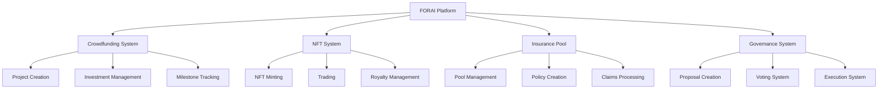

# FORAI Project

FORAI is a comprehensive DeFi platform built on Solana, integrating crowdfunding, NFT, insurance, and governance functionalities.

## Project Architecture



## Technical Stack

### Smart Contracts (Solana Programs)
- **Language**: Rust
- **Framework**: Solana Program Framework
- **Key Components**:
  - Account Management
  - State Management
  - Instruction Processing
  - Security Validation
  - Event Emission

### Architecture Components

1. **Core Modules**
   - Crowdfunding Contract
   - NFT Contract
   - Insurance Pool Contract
   - Governance Contract

2. **State Management**
   ```
   ├── State Definitions
   │   ├── Project State
   │   ├── NFT Metadata
   │   ├── Insurance Policy
   │   └── Governance Config
   ```

3. **Instruction Processing**
   ```
   ├── Instructions
   │   ├── Initialize
   │   ├── Execute
   │   ├── Update
   │   └── Close
   ```

4. **Security Layer**
   ```
   ├── Security
   │   ├── Access Control
   │   ├── Input Validation
   │   ├── State Validation
   │   └── Fund Safety
   ```

## Development Progress (60% Complete)

### Completed Features
- ✅ Basic framework implementation
- ✅ Core state definitions
- ✅ Instruction processing logic
- ✅ Security validation framework
- ✅ Event system

### In Progress
- 🚧 Insurance pool implementation
- 🚧 NFT trading functionality
- 🚧 Governance voting mechanism
- 🚧 Cross-module integration

### Pending
- ⏳ Advanced security features
- ⏳ Performance optimization
- ⏳ Complete testing suite
- ⏳ Documentation finalization

## Development Notes

Our development team is actively working on implementing the remaining features. We've faced some unique challenges:

1. **Code Base Translation**
   - Original codebase comments were in Chinese
   - Ongoing effort to translate and understand legacy code
   - Maintaining consistency in documentation

2. **Cross-Cultural Development**
   - International development team
   - Bridging communication gaps
   - Standardizing documentation format

3. **Technical Challenges**
   - Complex state management in Solana
   - Cross-program invocation handling
   - Optimizing for Solana's constraints

## Next Steps

1. Complete the insurance pool implementation
2. Finalize NFT trading functionality
3. Implement governance voting mechanism
4. Integrate all modules
5. Comprehensive testing
6. Documentation and code review

## Contributing

We welcome contributions from the community. Please ensure to:
1. Follow the coding standards
2. Provide comprehensive documentation
3. Include test cases
4. Submit detailed PR descriptions

## License

[License details to be added]
